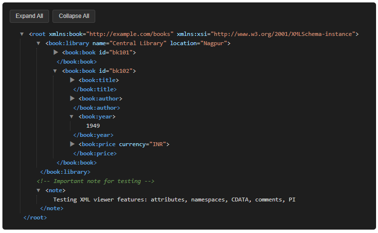

```markdown
# @akashchepe/xml-viewer

[](https://www.npmjs.com/package/@akashchepe/xml-viewer)
[](https://www.npmjs.com/package/@akashchepe/xml-viewer)
[](https://bundlephobia.com/package/@akashchepe/xml-viewer)
[](https://github.com/akashchepe/xml-viewer/blob/main/LICENSE)
[](https://angular.dev)

**Standalone Angular component** to beautifully display and explore XML content with syntax highlighting, collapsible tree structure, and expand/collapse controls.

Ideal for:
- API response debugging (SOAP, RSS, config files)
- Developer tools & admin panels
- XML-based data visualization

## ✨ Features

- **Collapsible tree view** – expand/collapse individual nodes or everything
- **Expand All / Collapse All** buttons
- **Syntax highlighting** – colorful tags, attributes, values, comments, CDATA
- **Pretty printing** – automatic indentation & formatting
- **Zero dependencies** – lightweight & tree-shakable
- **Standalone** – works perfectly with modern Angular (17+)
- **Dark theme** optimized out of the box
- Handles processing instructions, comments, CDATA, self-closing tags

## Demo Screenshot



*(Replace with your real screenshot or GIF – highly recommended!)*

## Installation

```bash
# npm
npm install @akashchepe/xml-viewer

# yarn
yarn add @akashchepe/xml-viewer

# pnpm (recommended in 2025+)
pnpm add @akashchepe/xml-viewer
```

## Quick Start (Standalone – Recommended)

```ts
import { Component } from '@angular/core';
import { XmlViewerComponent } from '@akashchepe/xml-viewer';

@Component({
  selector: 'app-xml-demo',
  standalone: true,
  imports: [XmlViewerComponent],
  template: `
    <xml-viewer [xml]="xmlContent"></xml-viewer>
  `,
})
export class XmlDemoComponent {
  xmlContent = `<?xml version="1.0" encoding="UTF-8"?>
<bookstore>
  <book category="fiction">
    <title lang="en">Harry Potter</title>
    <author>J. K. Rowling</author>
    <year>1997</year>
    <price>29.99</price>
  </book>
  <!-- Sample comment -->
  <book category="children">
    <title>The Very Hungry Caterpillar</title>
  </book>
</bookstore>`;
}
```

## Safe / Optional Empty State

```html
<!-- Shows nice placeholder when xml is undefined/null/empty -->
<xml-viewer [xml]="xmlData ?? ''"></xml-viewer>
```

## Component API

| Input   | Type   | Required | Default | Description                              |
|---------|--------|----------|---------|------------------------------------------|
| `xml`   | `string` | no     | —       | The raw XML string to render             |

No outputs or other inputs at the moment.

## Development & Contributing

```bash
# Clone repo
git clone https://github.com/akashchepe/xml-viewer.git
cd xml-viewer

# Install
pnpm install

# Build library
pnpm build:lib

# Run demo app (if you have one in workspace)
pnpm start
```

Pull requests welcome! Please follow conventional commits.

## License

MIT © [Akash Chepe](https://github.com/akashchepe)

---

I made with ❤️
```